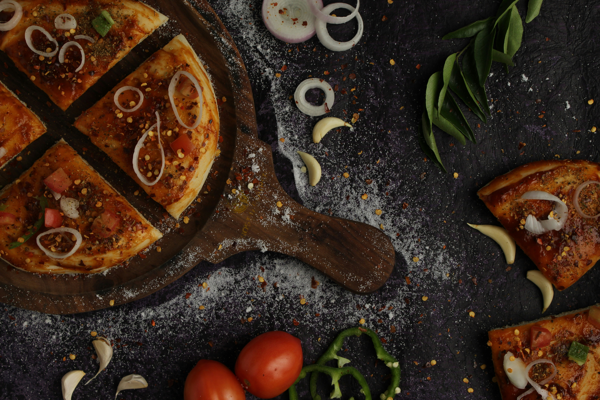
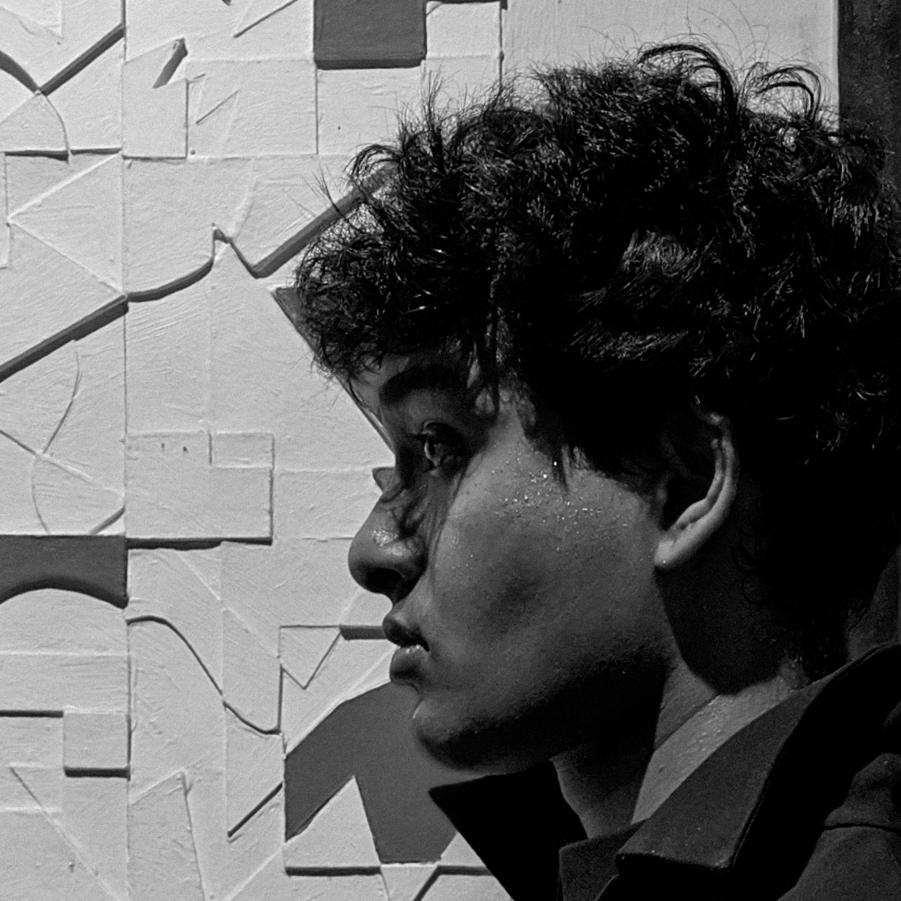

# POS System Frontend - Master Design Prompt (Updated for CakeCafe)

## Project Information
- **Project Name**: CakeCafe POS System
- **Database**: cake_cafe_db
- **Root Directory**: /Applications/XAMPP/xamppfiles/htdocs/CakeCafe

## Directory Structure

```
CakeCafe/                                    # Root directory
│
├── index.php                                # 🔑 LOGIN PAGE (Entry point)
├── home.php                                 # 🏠 DASHBOARD (After login)
│
├── assets/                                  # Static assets
│   ├── css/
│   │   └── style.css                       # Main stylesheet
│   ├── images/
│   │   ├── image.jpg                       # General image
│   │   └── N1.jpg                          # Developer page image
│   └── fpdf/                               # FPDF library for invoice generation
│       ├── fpdf.php
│       └── ...
│
├── config/                                  # Configuration files
│   └── dbcon.php                           # 🔌 Database connection (cake_cafe_db)
│
├── includes/                                # Reusable components
│   ├── sidebar.php                         # Main sidebar component
│   ├── Lsidebar.php                        # login page navbar
│   └── auth.php                            # 🔐 Authentication handler & check
│
├── handlers/                                # Backend processing
│   ├── delete_item.php                     # Delete menu items
│   ├── save_item.php                       # Add new menu items
│   ├── save_order.php                      # Process orders
│   ├── update_item.php                     # Update menu items
│   ├── invoice.php                         # Generate PDF invoices
│   └── logout.php                          # User logout
│
├── pages/                                   # Application pages
│   ├── pos.php                             # 💰 Point of Sale
│   ├── kitchen.php                         # 👨‍🍳 Kitchen display
│   ├── history.php                         # 📜 Order history
│   ├── sales-report.php                    # 📊 Sales analytics
│   ├── forecast.php                        # 📈 Demand forecasting
│   ├── menu-optimization.php               # 🍰 Menu analysis
│   ├── update-menu.php                     # ✏️ Menu management
│   ├── customer-feedback.php               # 💬 Feedback viewing
│   ├── feedback-tablet.php                 # 📱 Tablet feedback form
│   ├── user-management.php                 # 👥 User CRUD
│   ├── settings.php                        # ⚙️ App settings
│   ├── about.php                           # ℹ️ About page
│   ├── contact.php                         # 📧 Contact page
│   └── developers.php                      # 👨‍💻 Team page
│
└── invoices/                                # 📄 Generated PDF invoices
    ├── invoice_1.pdf
    ├── invoice_2.pdf
    └── ...
```

### File Access Pattern

```
📂 ROOT LEVEL (index.php, home.php)
   ├─ Include: includes/auth.php
   ├─ Include: includes/Lsidebar.php
   ├─ Include: config/dbcon.php
   ├─ Link CSS: assets/css/style.css
   ├─ Link Images: assets/images/
   └─ Form action: includes/auth.php (login)

📂 PAGES/ (all page files)
   ├─ Include: ../includes/auth.php
   ├─ Include: ../includes/Lsidebar.php
   ├─ Include: ../config/dbcon.php
   ├─ Link CSS: ../assets/css/style.css
   ├─ Link Images: ../assets/images/
   └─ Form action: ../handlers/*.php

📂 HANDLERS/ (processing files)
   ├─ Include: ../config/dbcon.php
   ├─ Redirect to: ../pages/*.php or ../index.php
   └─ FPDF: ../assets/fpdf/fpdf.php

📂 INCLUDES/ (auth.php, sidebar.php)
   ├─ Redirect: ../index.php (from auth.php)
   └─ Links: Relative to where included
```

## File Path Reference Guide

### For Files in `pages/` Directory

#### Include Statements
```php
<?php
session_start();
include '../includes/auth.php';      // Authentication
include '../config/dbcon.php';       // Database connection
?>
```

#### Sidebar Includes
```php
<?php include '../includes/Lsidebar.php'; ?>
```

#### CSS Links
```html
<link rel="stylesheet" href="../assets/css/style.css">
```

#### Image Sources
```html


```

#### Form Actions
```html
<form action="../handlers/save_order.php" method="POST">
<form action="../handlers/save_item.php" method="POST">
<form action="../handlers/delete_item.php" method="POST">
<form action="../handlers/update_item.php" method="POST">
<form action="../handlers/logout.php" method="POST">
```

#### Navigation Links (in pages)
```php
<a href="home.php">Dashboard</a>
<a href="pos.php">POS</a>
<a href="kitchen.php">Kitchen</a>
<a href="history.php">History</a>
<a href="sales-report.php">Sales Report</a>
<a href="menu-optimization.php">Menu</a>
<a href="customer-feedback.php">Feedback</a>
<a href="user-management.php">Users</a>
<a href="settings.php">Settings</a>
```

### For Files in `handlers/` Directory

#### Include Statements
```php
<?php
session_start();
include '../config/dbcon.php';       // Database connection
?>
```

#### Redirects After Processing
```php
header("Location: ../pages/pos.php");
header("Location: ../pages/home.php");
header("Location: ../pages/update-menu.php");
header("Location: ../pages/user-management.php");
exit();
```

#### FPDF Include (in invoice.php)
```php
require('../assets/fpdf/fpdf.php');
```

#### Invoice Output Path
```php
$pdf->Output('F', '../invoices/invoice_' . $order_id . '.pdf');
```

### For Files in `includes/` Directory

#### Navigation Links (in sidebar files)
Since sidebars are included in page files, paths are relative to the page:
```php
<a href="home.php" class="<?= $current_page == 'home.php' ? 'active' : '' ?>">
    <svg>...</svg>
    <span>Dashboard</span>
</a>
<a href="pos.php" class="<?= $current_page == 'pos.php' ? 'active' : '' ?>">
    <svg>...</svg>
    <span>POS</span>
</a>
```

#### Active Page Detection
```php
<?php $current_page = basename($_SERVER['PHP_SELF']); ?>
```

## Database Configuration

### config/dbcon.php
```php
<?php
// config/dbcon.php

$host = "localhost";        
$user = "root";             
$pass = "";                 
$dbname = "cake_cafe_db";  // Updated database name

// Create connection
$conn = new mysqli($host, $user, $pass, $dbname);

// Check connection
if ($conn->connect_error) {
    die("Database connection failed: " . $conn->connect_error);
}
?>
```

## Design Philosophy
Create a clean, sophisticated, and professional point-of-sale system interface with a **sidebar navigation pattern**. The design emphasizes elegance through typography (Crimson Pro serif for headings, Work Sans sans-serif for body), minimal but purposeful use of color, and generous white space. Every interaction should feel smooth and intentional.

## Color Palette & Usage

### Background Colors (Foundation - 70% usage)
- **#FBF9F5** - Primary background (body, cards, input fields, sidebar background)
- **#CEC3C1** - Borders, dividers, hover backgrounds, disabled states

### Accent Colors (Strategic - 30% usage)
- **#630116** - Primary brand color (logo, active nav, primary buttons, headings, critical actions)
- **#AF5B73** - Secondary accent (hover states, focus borders, links, secondary actions)
- **#7E892B** - Success states (confirmations, positive feedback, success messages)

### Text Colors
- **#2a2a2a** - Primary text color (var(--text-dark))
- **#6a6a6a** - Secondary/muted text (var(--text-muted))
- **White (#FFF)** - Text on dark backgrounds

## Typography System

### Font Families
```html
<link href="https://fonts.googleapis.com/css2?family=Crimson+Pro:wght@400;600;700&family=Work+Sans:wght@300;400;500;600&display=swap" rel="stylesheet">
```

- **Headings & Display**: 'Crimson Pro', serif
- **Body & UI**: 'Work Sans', sans-serif

### Type Scale
- **Page Titles (H1)**: 36-40px, font-weight: 600, color: #630116, letter-spacing: -0.5px, font-family: Crimson Pro
- **Section Titles (H3)**: 24px, font-weight: 600, color: #630116, letter-spacing: -0.3px, font-family: Crimson Pro
- **Body Text**: 15-16px, font-weight: 400, color: #2a2a2a, font-family: Work Sans
- **Labels**: 12-13px, font-weight: 500, text-transform: uppercase, letter-spacing: 0.5px, font-family: Work Sans
- **Logo Text**: 18px, font-weight: 600, color: #630116, letter-spacing: -0.3px, font-family: Crimson Pro

## Layout Architecture

### Sidebar Navigation (Fixed Left)
- **Width**: 260px (desktop), 72px (tablet - icons only)
- **Position**: Fixed left, full height
- **Background**: #FBF9F5
- **Border**: 1px solid #CEC3C1 on right edge
- **Z-index**: 100

#### Sidebar Structure
1. **Logo Section**
   - Padding: 32px 24px
   - Border-bottom: 1px solid #CEC3C1
   - Logo: SVG icon (32x32) + text "CakeCafe POS"
   - Icon: Checkmark in rounded square (#630116 background)

2. **Navigation Links**
   - Padding: 24px 16px (container)
   - Each link: 12px vertical padding, 16px horizontal
   - Border-radius: 6px
   - Gap between icon and text: 12px
   - Icon size: 18x18px, stroke-width: 2
   
3. **Footer**
   - Padding: 24px
   - Border-top: 1px solid #CEC3C1
   - Copyright text: 12px, color: #6a6a6a

#### Navigation States
- **Default**: color: #2a2a2a, SVG opacity: 0.7
- **Hover**: background: #CEC3C1, color: #630116, SVG opacity: 1
- **Active**: background: #630116, color: #FBF9F5, SVG stroke: #FBF9F5, opacity: 1
- **Transition**: all 0.2s ease

### Main Content Area
- **Margin-left**: 260px (desktop), 72px (tablet), 0 (mobile)
- **Min-height**: 100vh
- **Padding**: 48px 40px (desktop), 32px 24px (tablet), 24px 16px (mobile)
- **Transition**: margin-left 0.3s ease

### Content Containers
- **Max-width**: 440px (login forms), 1000px (contact/content), 1200px (developers)
- **Margin**: 0 auto (centered)

## Component Library

### Cards (White Containers)
```css
background: white;
border: 1px solid #CEC3C1;
border-radius: 8px;
padding: 32-48px;
box-shadow: 0 2px 8px rgba(99, 1, 22, 0.04);
/* Deeper shadow on hover */
box-shadow: 0 8px 24px rgba(99, 1, 22, 0.12);
```

### Form Elements

#### Input Fields
```css
width: 100%;
padding: 14px 16px;
font-size: 15px;
font-family: 'Work Sans', sans-serif;
background: #FBF9F5;
border: 1px solid #CEC3C1;
border-radius: 6px;
color: #2a2a2a;
transition: all 0.2s ease;

/* Focus State */
border-color: #AF5B73;
background: white;
box-shadow: 0 0 0 3px rgba(175, 91, 115, 0.1);
outline: none;

/* Placeholder */
color: #999;
```

#### Labels
```css
font-size: 13px;
font-weight: 500;
color: #2a2a2a;
margin-bottom: 8px;
text-transform: uppercase;
letter-spacing: 0.5px;
display: block;
```

#### Textareas
- Same styling as inputs
- resize: vertical
- min-height: 120px

### Buttons

#### Primary Button (e.g., Login, Send Message)
```css
width: 100%;
padding: 16px;
font-size: 15px;
font-weight: 600;
font-family: 'Work Sans', sans-serif;
background: #630116;
color: white;
border: none;
border-radius: 6px;
cursor: pointer;
transition: all 0.2s ease;
text-transform: uppercase;
letter-spacing: 0.5px;
margin-top: 8px;

/* Hover */
background: #4a010f;
transform: translateY(-1px);
box-shadow: 0 4px 12px rgba(99, 1, 22, 0.25);

/* Active */
transform: translateY(0);
```

#### Secondary Button (e.g., Contact Email links)
```css
display: inline-flex;
align-items: center;
gap: 8px;
padding: 12px 24px;
background: #FBF9F5;
color: #AF5B73;
text-decoration: none;
border-radius: 6px;
font-size: 14px;
font-weight: 500;
border: 1px solid #CEC3C1;
transition: all 0.2s ease;

/* Hover */
background: #AF5B73;
color: white;
border-color: #AF5B73;
transform: translateY(-1px);
```

### Message Alerts

#### Error Message
```css
background: #fff5f5;
border: 1px solid #630116;
color: #630116;
padding: 14px 18px;
border-radius: 6px;
margin-bottom: 28px;
font-size: 14px;
text-align: center;
display: flex;
align-items: center;
justify-content: center;
gap: 8px;
animation: shake 0.3s ease-out;
```

#### Success Message
```css
background: #f0f4e8;
border: 1px solid #7E892B;
color: #7E892B;
padding: 14px 18px;
border-radius: 6px;
margin-bottom: 24px;
font-size: 14px;
display: flex;
align-items: center;
gap: 8px;
animation: slideIn 0.3s ease-out;
```

### Special Components

#### Contact Method Cards (from contact.php)
```css
display: flex;
align-items: flex-start;
gap: 16px;
padding: 20px;
background: #FBF9F5;
border-radius: 6px;
margin-bottom: 16px;
transition: all 0.2s ease;

/* Hover */
background: #f5f3ef;
transform: translateX(4px);
```

#### Contact Icon
```css
width: 44px;
height: 44px;
background: #630116;
border-radius: 6px;
display: flex;
align-items: center;
justify-content: center;
flex-shrink: 0;
/* SVG inside: 20x20px, stroke: white */
```

#### Developer Cards (from developers.php)
```css
background: white;
border: 1px solid #CEC3C1;
border-radius: 8px;
padding: 40px 32px;
text-align: center;
box-shadow: 0 2px 8px rgba(99, 1, 22, 0.04);
transition: all 0.3s ease;

/* Hover */
transform: translateY(-4px);
box-shadow: 0 8px 24px rgba(99, 1, 22, 0.12);
border-color: #AF5B73;
```

#### Developer Photo
```css
width: 120px;
height: 120px;
border-radius: 50%;
object-fit: cover;
border: 3px solid #FBF9F5;
box-shadow: 0 4px 12px rgba(99, 1, 22, 0.15);
transition: all 0.3s ease;

/* Hover (on card) */
transform: scale(1.05);
border-color: #AF5B73;
```

#### Photo Badge (Developer role indicator)
```css
position: absolute;
bottom: 0;
right: 0;
width: 36px;
height: 36px;
background: #630116;
border-radius: 50%;
display: flex;
align-items: center;
justify-content: center;
border: 3px solid white;
box-shadow: 0 2px 8px rgba(99, 1, 22, 0.2);
/* SVG: 18x18px, stroke: white */
```

#### Skill Tags
```css
display: inline-block;
padding: 6px 12px;
background: #FBF9F5;
color: #7E892B;
font-size: 12px;
font-weight: 500;
border-radius: 4px;
text-transform: uppercase;
letter-spacing: 0.3px;
border: 1px solid #CEC3C1;
```

## Animations & Transitions

### Standard Transitions
```css
transition: all 0.2s ease; /* Most interactive elements */
transition: all 0.3s ease; /* Cards and larger elements */
transition: margin-left 0.3s ease; /* Layout shifts */
```

### Keyframe Animations

#### fadeIn (Page load)
```css
@keyframes fadeIn {
  from {
    opacity: 0;
    transform: translateY(20px);
  }
  to {
    opacity: 1;
    transform: translateY(0);
  }
}
/* Usage: animation: fadeIn 0.5s ease-out; */
/* Stagger with delay: animation: fadeIn 0.6s ease-out 0.1s backwards; */
```

#### shake (Error messages)
```css
@keyframes shake {
  0%, 100% { transform: translateX(0); }
  25% { transform: translateX(-8px); }
  75% { transform: translateX(8px); }
}
/* Usage: animation: shake 0.3s ease-out; */
```

#### slideIn (Success messages)
```css
@keyframes slideIn {
  from {
    opacity: 0;
    transform: translateY(-10px);
  }
  to {
    opacity: 1;
    transform: translateY(0);
  }
}
/* Usage: animation: slideIn 0.3s ease-out; */
```

## Spacing System

### Base Unit: 8px
- **Component padding**: 16px, 24px, 32px, 40px, 48px
- **Section margins**: 24px, 32px, 48px, 56px
- **Element gaps**: 4px, 8px, 12px, 16px, 20px, 24px
- **Form group margin**: 20px, 24px, 28px

### Specific Applications
- Sidebar logo padding: 32px 24px
- Nav links padding: 24px 16px (container), 12px 16px (individual)
- Login card padding: 48px 40px (desktop), 36px 28px (tablet), 32px 24px (mobile)
- Page header margin-bottom: 48px, 56px
- Contact/info card padding: 32px

## Grid Layouts

### Contact Grid (contact.php)
```css
display: grid;
grid-template-columns: 1fr 1fr;
gap: 32px;
/* Mobile: grid-template-columns: 1fr; gap: 24px; */
```

### Developer Grid (developers.php)
```css
display: grid;
grid-template-columns: repeat(auto-fit, minmax(320px, 1fr));
gap: 32px;
/* Mobile: grid-template-columns: 1fr; gap: 24px; */
```

## Responsive Breakpoints

### Desktop (default)
- Sidebar: 260px width
- Content margin-left: 260px
- Full features visible

### Tablet (max-width: 768px)
- Sidebar: 72px width (icons only)
- Hide: logo text, nav link text, footer text
- Content margin-left: 72px
- Logo: centered, padding: 24px 16px
- Nav links: centered, padding: 12px
- Reduced content padding: 32px 24px

### Mobile (max-width: 480px)
- Sidebar: hidden (margin-left: 0)
- Content: full width with 16px padding
- Cards: reduced padding (32px 24px)
- Font sizes: slightly reduced (page titles 28-30px)

## Icons & SVG

### Icon Specifications
- **Stroke-width**: 2px (consistent)
- **Size**: 18x18px (navigation), 20x24px (content icons)
- **Style**: Line icons, no fill (except logo)
- **Colors**: currentColor (inherits text color) or explicit stroke colors

### Logo Icon
```svg
<rect x="4" y="4" width="24" height="24" rx="4" fill="#630116"/>
<path d="M12 16L14.5 18.5L20 13" stroke="#FBF9F5" stroke-width="2.5"/>
```

## Interactive States Checklist

### Hover States
- Links: color change + underline (optional)
- Buttons: background darkens, lift shadow, transform: translateY(-1px)
- Cards: lift shadow, border color change, transform: translateY(-4px)
- Nav items: background: #CEC3C1, color: #630116
- Icons: opacity: 1

### Focus States
- Inputs: border-color: #AF5B73, box-shadow: 0 0 0 3px rgba(175, 91, 115, 0.1)
- Buttons: outline or shadow indicating focus
- Links: outline or underline

### Active States
- Nav links: background: #630116, color: #FBF9F5, icon stroke: #FBF9F5
- Buttons: transform: translateY(0) (pressed down)
- Selected items: border or background in accent color

### Disabled States
- Opacity: 0.5-0.6
- Background: #CEC3C1
- Cursor: not-allowed
- No hover effects

## Accessibility Standards

### Contrast Ratios
- Primary text (#2a2a2a) on #FBF9F5: Must meet WCAG AA
- White text on #630116: Must meet WCAG AA
- White text on #AF5B73: Must meet WCAG AA

### Interactive Elements
- Minimum touch target: 44x44px (especially on mobile)
- Focus indicators: Visible on all interactive elements
- Keyboard navigation: Full support with clear focus states
- ARIA attributes: Proper labels and roles

### Forms
- Labels: Always present and associated
- Placeholders: Supplementary, not primary instruction
- Error messages: Clear, specific, and accessible
- Required fields: Properly marked

## CSS Variables Pattern

```css
:root {
  --bg-primary: #FBF9F5;
  --bg-secondary: #CEC3C1;
  --accent-primary: #630116;
  --accent-secondary: #AF5B73;
  --accent-success: #7E892B;
  --text-dark: #2a2a2a;
  --text-muted: #6a6a6a;
}
```

## Universal Reset

```css
* {
  margin: 0;
  padding: 0;
  box-sizing: border-box;
}

body {
  font-family: 'Work Sans', sans-serif;
  background: var(--bg-primary);
  color: var(--text-dark);
  min-height: 100vh;
}
```

## PHP Integration Patterns

### Session Management
- Use `session_start()` at top of every page
- Store error/success messages in `$_SESSION['error']` and `$_SESSION['success']`
- Display and immediately unset: `<?php unset($_SESSION['error']); ?>`

### Active Navigation Detection
```php
<?php $current_page = basename($_SERVER['PHP_SELF']); ?>
<a href="page.php" class="<?= $current_page == 'page.php' ? 'active' : '' ?>">
```

### Dynamic Content
- Year: `<?= date('Y'); ?>`
- Escape output: `<?= htmlspecialchars($variable); ?>`

### Include Pattern (for pages/)
```php
<?php 
session_start();
include '../includes/auth.php';
include '../config/dbcon.php';
include '../includes/Lsidebar.php';
?>
```

## Design Principles Summary

1. **Serif for elegance, Sans-serif for clarity**: Crimson Pro for headings/branding, Work Sans for UI/body
2. **Color with purpose**: #630116 for authority, #AF5B73 for friendliness, #7E892B for success
3. **Generous spacing**: Never cramped, always room to breathe
4. **Subtle interactions**: Gentle transforms, smooth transitions, purposeful feedback
5. **Typography hierarchy**: Clear visual distinction between headings, body, and labels
6. **Consistent patterns**: Reuse the same component styling across pages
7. **Progressive disclosure**: Show what's needed, hide what's not
8. **Touch-friendly**: 44px minimum targets, 14-16px minimum font sizes
9. **Performance**: Smooth 60fps animations, instant feedback
10. **Accessibility first**: Proper contrast, keyboard support, semantic HTML

## Final Implementation Notes

- Always use the CSS variable names for colors
- Maintain consistent border-radius (6px for inputs/buttons, 8px for cards)
- Keep box-shadows subtle: 0 2px 8px for resting, 0 8px 24px for hover
- Use rgba(99, 1, 22, 0.04-0.25) for all shadows to maintain color harmony
- Stagger animations with 0.1s delays for cascading effects
- Test all interactions at 60fps
- Validate HTML and ensure semantic structure
- Always include proper meta tags and font links

---

**Core Philosophy**: This is a professional business application for a cake café. Every design decision should support efficiency, clarity, and trust. The interface should feel refined but never fussy, sophisticated but never complicated. Let typography and spacing do the heavy lifting.